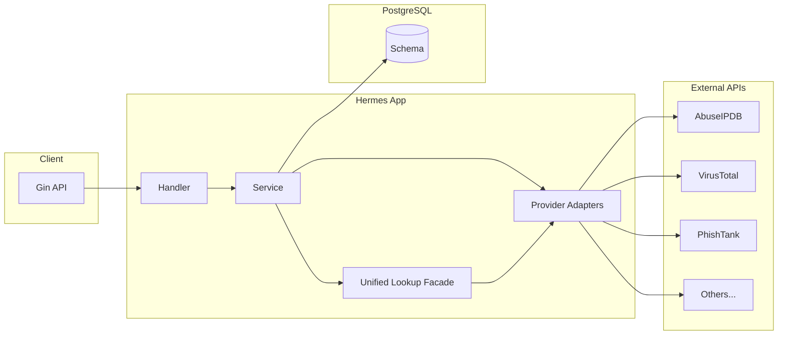

# Hermes 資安供應商整合服務 — 實作計畫

## 1. 架構概覽




- **對外**：統一查詢（如 `POST /api/v1/lookup`，依 type 彙整多供應商）＋ 各供應商獨立端點（如 `GET /api/v1/providers/abuseipdb/ip/:ip`）。
- **儲存**：PostgreSQL 存放查詢結果快取、稽核紀錄、供應商設定；依你方規範做日誌與敏感欄位匿名化。

## 2. 專案目錄結構（建議）

```
Hermes/
├── cmd/
│   └── server/
│       └── main.go
├── internal/
│   ├── config/          # 從 .env 讀取
│   ├── model/            # GORM models（僅 DB 對應）
│   ├── dto/              # Request DTO
│   ├── vo/               # Response VO（含 Swagger）
│   ├── handler/          # Gin handlers
│   ├── service/          # 業務邏輯、統一 lookup
│   ├── provider/         # 各供應商 adapter
│   │   ├── adapter.go    # 共通 interface
│   │   ├── abuseipdb/
│   │   ├── virustotal/
│   │   ├── phishtank/
│   │   └── ...
│   ├── repository/       # DB 存取
│   └── middleware/       # 日誌、匿名化、rate limit
├── database/
│   └── migrations/       # 僅新增、不修改既有檔
├── docker/
│   └── Dockerfile        # 多階段建置 Go 二進位
├── .env.example
├── .env                  # 本地開發用，不提交
├── docker-compose.yml   # app + postgres
├── Makefile             # migrate up/down、swagger、test
└── go.mod
```

## 3. 供應商清單（來自 indo_src.txt）

以下依文件分類，實作時以 **interface + 單一 adapter 一資料夾** 擴充；第一版可先做標註為「建議優先」者。


| 分類                  | 供應商                             | 說明                 | 建議優先 |
| ------------------- | ------------------------------- | ------------------ | ---- |
| Threat Intelligence | AbuseIPDB                       | IP 名譽、黑名單          | 是    |
|                     | BinaryEdge.io                   | IP/網域/漏洞掃描         | 否    |
|                     | EmailRep                        | 信箱名譽               | 否    |
|                     | Pulsedive                       | IOC 情資             | 否    |
|                     | ThreatMiner                     | 網域/IP/惡意程式情資       | 否    |
| Domain/URL Security | Google Safe Browsing            | 惡意 URL             | 是    |
|                     | PhishTank                       | 釣魚 URL             | 是    |
|                     | URLhaus                         | 惡意 URL             | 是    |
|                     | urlscan.io                      | URL 掃描             | 是    |
|                     | CriminalIP.io                   | IP/網域情資            | 否    |
|                     | IP ASN History (D4/CIRCL)       | IP ASN 歷史          | 否    |
| CVE / 漏洞            | National Vulnerability Database | CVE/CVSS           | 是    |
|                     | CVE Search (CIRCL)              | CVE 查詢             | 是    |
|                     | Vulners                         | 漏洞/修補              | 否    |
| Malware / Sandbox   | VirusTotal                      | 檔案/URL 掃描          | 是    |
|                     | Hybrid Analysis                 | 沙箱                 | 否    |
|                     | Malshare                        | 惡意樣本               | 否    |
|                     | MalwareBazaar (abuse.ch)        | 惡意樣本               | 否    |
| 其他                  | HaveIBeenPwned                  | 外洩信箱/密碼            | 是    |
|                     | SSL Labs                        | SSL 評等             | 否    |
| 選用（商業）              | SOCRadar 系列                     | 以 env 開關，無 key 則略過 | 否    |


## 4. PostgreSQL Schema 與 Migration

- **Migration 工具**：建議使用 [golang-migrate](https://github.com/golang-migrate/migrate) 或 [goose](https://github.com/pressly/goose)，嚴格「只新增 migration 檔、不修改既有」。
- **命名**：`database/migrations/YYYYMMDDHHMMSS_description.up.sql` / `.down.sql`。

### 4.1 核心資料表（建議第一版 migration）

- **providers**  
  - 供應商主檔：`id`, `code`（如 `abuseipdb`）, `name`, `base_url`, `enabled`, `rate_limit_per_min`, `created_at`, `updated_at`。  
  - 用於開關與限流，API Key 不存 DB，僅放 .env。
- **lookup_requests**  
  - 每次查詢一筆：`id`, `request_id`（UUID）, `indicator_type`（ip/domain/url/hash/email）, `indicator_value`（可做 hash 或遮罩以利匿名化）, `user_id`（可選）, `created_at`。  
  - 若需匿名化：`indicator_value` 存 hash 或前綴，原始值僅在記憶體中使用。
- **lookup_results**  
  - 快取與歷史：`id`, `lookup_request_id`（FK）, `provider_code`, `raw_response`（jsonb）, `cached_at`, `ttl_seconds`。  
  - 可加索引：`(lookup_request_id, provider_code)`、`cached_at` 供 TTL 清理。
- **audit_logs**  
  - 稽核：`id`, `request_id`, `action`, `resource_type`, `resource_id`, `ip_hash` 或匿名化欄位, `created_at`。  
  - 不記錄 PII/完整 IP；依你方規範可再縮減欄位。
- **schema_migrations**  
  - 由 migration 工具維護，勿手動改。

### 4.2 ER 關係（概念）

- `lookup_requests` 1 — N `lookup_results`（一次查詢對多個供應商結果）。  
- `lookup_requests` / `lookup_results` 與 `audit_logs` 可透過 `request_id` 關聯，不強制 FK 以利彈性與匿名化。

### 4.3 索引與約束

- `providers(code)` UNIQUE。  
- `lookup_requests(request_id)` UNIQUE；`(indicator_type, created_at)` 可選（供依類型與時間查詢）。  
- `lookup_results(lookup_request_id, provider_code)` UNIQUE；`cached_at` 索引供定期刪除過期快取。

## 5. Go Docker 映像與執行環境

- **Dockerfile**（建議放在 `docker/Dockerfile` 或專案根目錄）：  
  - 多階段：Stage 1 用 `golang:1.21-alpine` 建置二進位；Stage 2 用 `alpine` 只放二進位與 CA，非 root 使用者執行。  
  - 建置：`go build -o /app/hermes ./cmd/server`。  
  - 不把 .env 打進映像；執行期由 `docker-compose` 或 K8s 注入。
- **docker-compose.yml**（範例）：  
  - **service: hermes**  
    - build: 指向上述 Dockerfile。  
    - ports: 例如 `8080:8080`。  
    - environment: 從 env_file 讀取 `.env`，或直接寫 `POSTGRES_DSN`, `HTTP_PORT` 等。  
    - depends_on: postgres（可加 healthcheck 等待 DB 就緒）。
  - **service: postgres**  
    - image: postgres:15-alpine。  
    - environment: POSTGRES_USER, POSTGRES_PASSWORD, POSTGRES_DB。  
    - volumes: 持久化資料目錄；可掛載 `./database/init` 若需初始 SQL（非取代 migration）。
  - 首次啟動順序：先 `migrate up`（可在 entrypoint 或 CI 做），再啟動 app。
- **.env 與 .env.example**：見下一節。  
- 若需同時支援本地開發：可在 `Makefile` 提供 `make run`（本機 go run）、`make docker-up`（compose up）、`make migrate-up`。

## 6. .env 與 .env.example

- **.env**：實際值、不提交；用於本地或部署時由 CI/Secret 覆寫。  
- **.env.example**：列出所有變數與範例值（可為空或假值），提交到版控，供團隊與 CI 參考。

### 6.1 建議變數清單


| 變數                             | 說明                   | .env.example 範例                                                             |
| ------------------------------ | -------------------- | --------------------------------------------------------------------------- |
| `HTTP_PORT`                    | 服務埠                  | `8080`                                                                      |
| `POSTGRES_DSN`                 | 連線字串                 | `host=postgres user=hermes password=changeme dbname=hermes sslmode=disable` |
| `LOG_LEVEL`                    | 日誌等級                 | `info`                                                                      |
| `CACHE_TTL_SECONDS`            | 結果快取 TTL             | `3600`                                                                      |
| `ABUSEIPDB_API_KEY`            | AbuseIPDB            | （空或 `your-key`）                                                             |
| `VIRUSTOTAL_API_KEY`           | VirusTotal           | （空）                                                                         |
| `PHISHTANK_APP_KEY`            | PhishTank（選用）        | （空）                                                                         |
| `GOOGLE_SAFE_BROWSING_API_KEY` | Google Safe Browsing | （空）                                                                         |
| `URLSCAN_API_KEY`              | urlscan.io           | （空）                                                                         |
| `HIBP_API_KEY`                 | HaveIBeenPwned       | （空）                                                                         |
| `NVD_API_KEY`                  | NVD（選用，提高限流）         | （空）                                                                         |
| `BINARYEDGE_API_KEY`           | BinaryEdge           | （空）                                                                         |
| `CRIMINALIP_API_KEY`           | CriminalIP           | （空）                                                                         |
| `SOCRADAR_*`                   | SOCRadar 相關（若納入）     | （空）                                                                         |


其餘供應商依實作順序在 .env.example 中補上，格式可統一為 `{PROVIDER}_API_KEY` 或 `{PROVIDER}_BASE_URL`。  
在程式中：若某供應商 key 為空則該 adapter 回傳「未設定」或略過，不中斷統一查詢。

## 7. 實作順序建議（對應 todo）

1. **專案初始化**：go mod init、Gin router、讀取 config 從 env、健康檢查 `GET /health`。
2. **Docker**：Dockerfile 與 docker-compose（app + postgres），確認本機可 `docker-compose up` 並連到 DB。
3. **Migration 與 Schema**：建立 `database/migrations`、第一版 up/down（providers, lookup_requests, lookup_results, audit_logs）、在啟動時執行 migrate。
4. **GORM models**：`internal/model` 對應上述表，不混用 DTO/VO。
5. **DTO/VO**：統一 lookup 的 Request/Response 與各供應商回傳結構（可先做 1～2 個供應商當範例）。
6. **Provider adapter 介面**：定義 `Lookup(ctx, indicatorType, value) (Result, error)` 等，並實作 AbuseIPDB、VirusTotal、PhishTank、urlscan.io、HaveIBeenPwned、NVD、CIRCL CVE（至少 5～7 個）。
7. **Service + Handler**：統一查詢（依 type 選 adapter、可並行）、寫入 lookup_requests / lookup_results、呼叫 repository。
8. **各供應商獨立端點**：例如 `GET /api/v1/providers/:code/ip/:ip`，內部轉發到對應 adapter。
9. **.env 與 .env.example**：補齊變數、在 config 中讀取並提供給 adapter。
10. **Middleware**：請求日誌、錯誤處理、可選 rate limit；日誌中對 indicator_value 做匿名化。
11. **Swagger**：VO 註解、`make swagger` 產生並掛到路由。
12. **單元測試**：adapter 介面 mock、service 與 handler 測試；覆蓋率達標。

## 8. 注意事項（對齊你的規範）

- **ERD**：先用 dbdiagram.io / draw.io 畫出上述表與關聯，再產出 migration，變更需審查並記錄。  
- **Migration**：僅新增檔案、不修改既有；所有環境用同一套 migration。  
- **Model / DTO / VO**：Handler 與 Service 只處理 DTO/VO，用 copier 或 mapstructure 與 Model 轉換；Swagger 只從 VO 產生。  
- **安全**：API Key 僅在 .env 或 Secret；查詢參數與 DB 儲存做匿名化；不記錄完整 PII/ESG 相關欄位。  
- **錯誤處理**：Go 層明確 return error；HTTP 4xx/5xx 由 middleware 或 handler 統一轉成 VO。

此計畫涵蓋：Go Docker 化服務、PostgreSQL schema 與 migration、.env/.env.example，以及可擴充的資安供應商整合架構；實作時可依人力先做「核心子集」再逐步加入其餘供應商與 SOCRadar 選用整合。